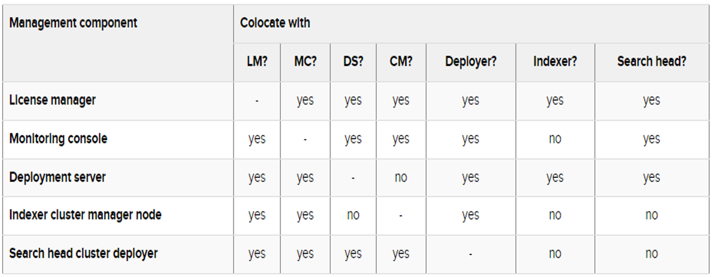

# How to Create a Distributed Environment

## Distributed Search 
>To support larger environments, however, where data originates on many machines and where many users need to search the data, you can scale your deployment by distributing Splunk Enterprise instances across multiple machines. When you do this, you configure the instances so that each instance performs a specialized task. For example, one or more instances might index the data, while another instance manages searches across the data.

## Distributed deployment provides the ability to:

>Scale Splunk Enterprise functionality to handle the data needs for enterprises of any size and complexity.
Access diverse or dispersed data sources.

# SCALING SPLUNK ENTERPRISE
>To scale your system, you can split this functionality across multiple specialized instances of Splunk Enterprise. These instances can range in number from just a few to many thousands, depending on the quantity of data that you are dealing with and other variables in your environment.

In a typical distributed deployment, each instance occupies one of three tiers that correspond to the key processing functions:
- Data input  - It ingests data from files, the network, or other sources.
- Indexing - It parses and indexes the data.
- Searching - It runs searches on the indexed data.
  
It is possible to combine some of these tiers or configure processing in other ways, but these three tiers are typical of most distributed deployments.

# SPLUNK COMPONENTS
Specialized instances of Splunk Enterprise are known collectively as components. With one exception, components are full Splunk Enterprise instances that have been configured to focus on one or more specific functions, such as indexing or search. The exception is the universal forwarder, which is a lightweight version of Splunk Enterprise with a separate executable.

### There are several types of Splunk Enterprise components. 
#### They fall into two broad categories:
- Processing components: These components handle the data.
- Management components: These components support the activities of the processing components.

## TYPES OF PROCESSING COMPONENTS
There are three main types of processing components:
- Forwarders
- Indexers
- Search heads

## MANAGEMENT COMPONENTS
- Deployment Server
- Cluster Manager/Master
- Deployer Monitoring Console
- License Manager

# Components that help to manage your deployment
Management components support the activities of the processing components. As with processing components, management components are specially configured versions of Splunk Enterprise instances.

## Types of management components
A deployment usually includes one or more of these management components:

- The license manager handles Splunk Enterprise licensing.
- The monitoring console performs centralized monitoring of the entire deployment.
- The deployment server updates configurations and distributes apps to processing components, primarily forwarders.
- The indexer cluster managernode, sometimes referred to as the "cluster manager", coordinates the activities of an indexer cluster. It also handles updates for indexer clusters.
- The search head cluster deployer handles updates for search head clusters.

# Colocate Management Components


[Read More on Distributed Environment](https://docs.splunk.com/Documentation/Splunk/9.3.1/Deploy/Manageyourdeployment)


## splunk@ip-172-31-88-152:/opt/splunk/etc/deployment-apps$
```bash
README         Splunk_TA_windows  _splunk_tmp       all_deploymentclient_apps
Splunk_TA_nix  _splunk_ds_info    all_base_indexer  all_uf_outputs
```

## The deployment server systems local
```css
splunk@ip-172-31-88-152:/opt/splunk/etc/system/local$ ls
README              health.conf     restmap.conf      web.conf
distsearch.conf     migration.conf  server.conf
global-banner.conf  outputs.conf    serverclass.conf
```