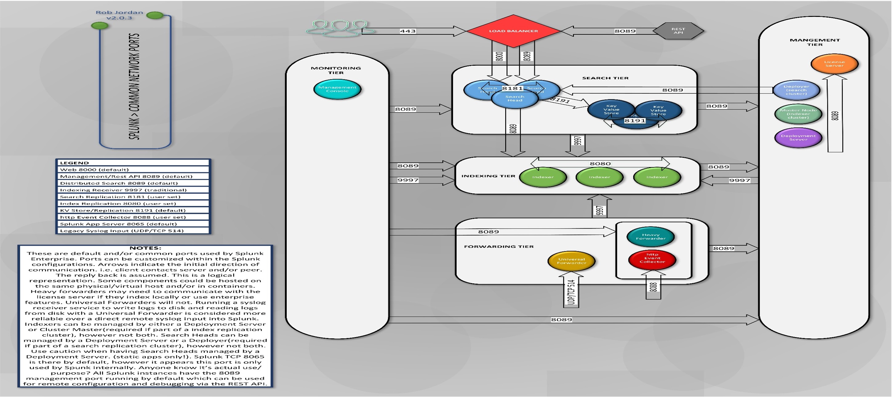
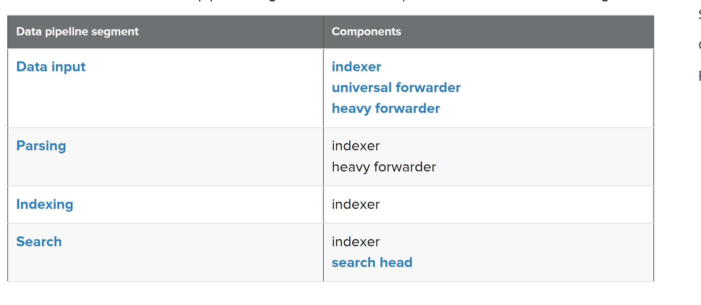

# SPLUNK PORTS


# SPLUNK DATA PIPELINE
The route that data takes through Splunk Enterprise, from its origin in sources such as log files and network feeds, to its transformation into searchable events that encapsulate valuable knowledge.

In simple terms, it is how data moves through Splunk.

The data pipeline includes these segments:
- 1. Input
- 2. Parsing
- 3. Indexing
- 4. Search

You can assign each of these segments to a different Splunk Enterprise instance or component.

# How Data Moves Through Splunk
A Splunk deployment typically has three processing tiers:
- 1. Data Input
- 2. Indexing
- 3. Search Management

In a distributed Splunk Deployment, each Splunk processing component resides on one of the tiers.

[Read More on Data Pipeline](https://docs.splunk.com/Documentation/Splunk/9.3.1/Deploy/Datapipeline)

# Link Between Tier And Segments
The correspondence between the three typical processing tiers and the four data pipeline segments is this:
- 1. The data input tier handles the input segment.
- 2. The indexing tier handles the parsing and indexing segments.
- 3. The search management tier handles the search segment.
  
[Read More](https://docs.splunk.com/Documentation/Splunk/9.3.1/Deploy/Componentsofadistributedenvironment)

# Splunk Components and Segments


# Data Pipeline in Details


# Demo Time – USING PROPS.CONF & TRANSFORMS.CONF

## Use props.conf to perform timestamp extraction at index-time.
```bash

```
[Read More on props.conf](https://docs.splunk.com/Documentation/Splunk/latestData/Configuretimestamprecognitionhttps://kinneygroup.com/blog/splunk-magic-8-props-conf/)

# Use props.conf to anonymize sensitive data
[Read More](https://docs.splunk.com/Documentation/Splunk/latest/Data/Anonymizedata#Anonymize_data)

Route specific events to specific indexes using both props.conf and transforms.conf

