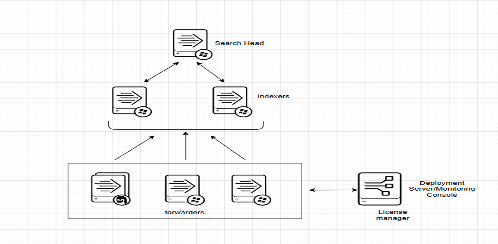

# SPLUNK DISTRIBUTED ENVIRONMENT TOPOLOGY

# Colocate Management Components

## Demo Time – Setting up a Splunk distributed environment 
- Spin up 7 AWS instances with 6 Linux servers as 1 windows server
- Install Splunk full instance on 4 of the Linux servers and Splunk light weight instance on the 2 Linux and windows servers
### Configure these components
- 1 Search Head, 2 Indexers, 1 DS/MC/LM and 3 Ufs
- Create/install Apps and TAs and deploy to Ufs via DS 
- Create Serverclass and setup Distributed search and Monitoring Console to Monitor environment

## How to set up the Deployment Server
NB: There must be a deployment app with a deploymentclient.conf file in its local directory under the /opt/splunk/etc/apps directory to establish the initial communication.

NB: The app (all_deploymentclient_app) will be place in the deployment-apps dirctory with the same name and configuration for the clients only at their apps directory to establish the initial communication. but you will place the samething on the deployment server at deployment_apps dirctory for future changes such as IP Address of the Deployment Server.

NB: It very important to have to same name for the app on all clients and Deployment server deployment apps directory so that any future changes will only be made on the Desployment Server Deployment Apps Directoy and Clients will download it to update their deploymentclient.conf configuration.

### How to create an app (creating a directory)
```bash
mkdir -p all_deploymentclient_app/local
```

### Create the deploymentclient.conf in all_deploymentclient_app directory
note: make sure app name (all_deploymentclient_ap, anyname) and deploymentclient.conf (compulsory) must be the same on all servers.
#### Splunk Enterprise
```bash
 cd /opt/splunk/etc/apps ## SPLUNK_HOME=/opt/splunk/
```
#### Splunk Universal Forwarders
```bash
 cd /opt/splunkforwarder/etc/apps ## SPLUNK_HOME=/opt/splunkforwarder/
```
NB: You have to create the all_deploymentclient_app in the above directory.

## Why the deploymentclient.conf in not placed in the system/local
So, if you place deploymentclient.conf in system/local, it will serve as a global configuration for all deployment clients on that Splunk instance, which is often useful for central configurations but **may limit app-specific customization.**

```bash
$SPLUNK_HOME/
├── etc/
│   ├── apps/
│   │   ├── all_deploymentclient_app/
│   │   │   ├── default/
│   │   │   ├── local/
│   │   │   │   └── deploymentclient.conf
│   │   └── another_app/
│   ├── system/
│   │   ├── local/
│   │   │   ├── server.conf
│   │   │   ├── inputs.conf
│   │   │   └── outputs.conf
│   │   └── README
│   └── ...
```
## How to establish the communication
```bash
 cd /opt/splunk/etc/apps/all_deploymentclient_app/local
```
Add this to the deploymentclient.conf files
```bash
nano /opt/splunk/etc/apps/all_deploymentclient_app/local/deploymentclient.conf 
```
```bash
[deployment-client]

[target-broker:deploymentServer]
targetUri = ip-172-01-01-001.ec2.internal:8089  
```
After the above command, restart splunk
NB: The targetUri, replace with your deployment server ip address.

## Alternatively you can run this command at $SPLUNK_HOME/bin
```bash
./splunk set deploy-poll <ip address/hostname>:8089
```
The problem is the above command will create the deploymentclient.conf at the system/local which have to move to the apps local for the deployment configurations to work properly

### When you want to alter the default settings under [deployment-client] stanza
```bash
[deployment-client]
disabled = false 
phoneHomeIntervalInSecs = 300

[target-broker:deploymentServer]
targetUri = ip-172-01-01-001.ec2.internal:8089  
```
### Each part has a purpose:
- **[deployment-client]:** Activates the client status.
- **disabled = false** ensures the client is active.
- **phoneHomeIntervalInSecs = 300** determines how frequently the client checks for updates.
- **[target-broker:deploymentServer]:** Specifies the deployment server’s address.
- **targetUri** tells the client where to look for configuration updates.

NB: **ip-72-01-01-001.ec2.internal**(change to your deployment server private or dns ip address)

#NB This will be done on all the clients we want to manage including the DS deployment-apps directory (The question i was having in mind was what if you have thousands of clients, how do you automate the task, the AI response was Ansible or Chef or Puppet or Terraform to automate the deploymentclient.conf task).


# How to Install TA 's on the front and back end
On the Deployment Sever, You will click on 
```bash
Apps > Manage Apps > Browse More Apps > Search the App > Click on Install
```
We can also download, secure copy to our server and untar to the apps directory or we can use linux command to install it on our apps directory

### Since we want to deploy them to the clients, We have to move the apps from the apps directory to the deployment-apps directory on the Deployment Server back end. The Deployment Server does not own those apps but its just a repository for apps ready for deployment to clients
```bash
 cd /opt/splunk/etc/apps 
```
```bash
 cd /opt/splunk/etc/deployment_apps 
```
### The path where you move the apps from to the deployment-apps

```bash
$SPLUNK_HOME/
├── etc/
│   ├── apps/
│   │   ├── Splunk_TA_windows/
│   │   │   ├── default/
│   │   │   │   └── app.conf
│   │   │   ├── local/
│   │   │   │   └── app.conf
│   │   │   └── README
│   │   ├── Splunk_TA_nix/
│   │   │   ├── default/
│   │   │   │   └── app.conf
│   │   │   ├── local/
│   │   │   │   └── app.conf
│   │   │   └── README
│   ├── system/
│   │   ├── local/
│   │   ├── README
│   └── ...
```
## You will move it to the deployment-apps directory
```bash
$SPLUNK_HOME/etc/deployment-apps/
├── Splunk_TA_windows/
│   └── local/
│       └── inputs.conf
├── Splunk_TA_nix/
│   └── local/
│       └── inputs.conf
├── all_deploymentclient_apps/
   └── local/
      └── deploymentclient.conf
```
NB: Any app you install on splunk web and want to deploy to clients must be move from the apps directory to the deployment-apps dirctory on the deployment server only.

NB: Make sure all apps you enable Restart Splunkd on its edit section at forward and management page.

# Disabling the DS/MC/LM and the search Head from indexing logs
Creates an outputs.conf and put the command inside (dont forget to modify the ip address)

## Private IP DNS name (IPv4 only)
```bash
[indexAndForward] 
index = false 

[tcpout] 
defaultGroup = my_search_peers 
forwardedindex.filter.disable = true 
indexAndForward = false 
 
[tcpout:my_search_peers] 
server = ip-172-31-04-055.ec2.internal:9997,ip-172-01-82-004.ec2.internal:9997
```
### You create a load balance for your indexers, simply, the data that goes into splunk indexes they have some amout of equal recieving utilisation 

## Private IPv4 addresses
```bash
[indexAndForward] 
index = false 

[tcpout] 
defaultGroup = my_search_peers 
forwardedindex.filter.disable = true 
indexAndForward = false 
 
[tcpout:my_search_peers] 
server = 172.31.04.055:9997,172.01.82.004:9997
```
NB: If after this configuration you realize your clients are not phoning home, then may your splunk enterprise may have a bug, so will use the command below instead. Only on the Deployment Server, dont add to the search head.

## Private IPv4 addresses
```bash
[indexAndForward] 
index = true
selectiveIndexing = true

[tcpout] 
defaultGroup = my_search_peers 
forwardedindex.filter.disable = true 
indexAndForward = false 

[tcpout:my_search_peers] 
server = 172.31.04.055:9997,172.01.82.004:9997
```
After this you restart, since its a general settings but server specific modifications, you have to reload on the server class so that its will not affect other server classes.

```bash
/opt/splunk/bin/splunk reload deploy-server -class <class name>
```

### The Move Command (You have to be in the Apps Directory for the command below to work)
```bash
mv Splunk_TA_windows /opt/splunk/etc/deployment-apps
```
You can do this at both Both back and front end to listen and monitor the incoming data from the forwarders.

# How to enable the receiving port on the indexers (9997)
## inputs.conf
```bash
[splunktcp://:9997]
connection_host = dns
```

## Doing it at the front end (Splunk Web)
```bash
Settings > Forwading and Receiving > Configure and Receiving > New Receiving Port
```
# Creatin an App to send output configurations to all forwarders
We have to create an app (directory) at the deployment server deployment-apps directory.
```bash
mkdir all_fwd_outputs/local -p
```
Inside the app local we put the outputs.conf to be deployed configurations to the forwarders 
```bash
[tcpout]
defaultGroup= default-autolb-group

[tcpout:default-autolb-group]
server = ip-172-01-94-155.ec2.internal:9997,ip-172-11-02-204.ec2.internal:9997

[tcpout-server://ip-172-31-94-255.ec2.internal:9997]
```
## Example of the path to the Directory
```bash
$SPLUNK_HOME/etc/deployment-apps/
├── Splunk_TA_windows/
│   └── local/
│       └── inputs.conf
├── Splunk_TA_nix/
│   └── local/
│       └── inputs.conf
├── all_deploymentclient_apps/
│   └── local/
│       └── deploymentclient.conf
├── all_uf_outputs/
│   └── local/
│       └── outputs.conf
```
NB: Please change the IP Address to your indexers IP Address (You can use the private ip address also) to help the forwarders send data to the indexers on port 9997 (splunk receiving port).

NB: when you make changes on the deployment server configurations, you don’t restart but rather reload for the clients to be able to download this files 

## Change to splunk bin directory
```bash
./splunk reload deploy-server  # this will reload all the server classes
```
```bash
./splunk reload deploy-server -class <server name>
```

# How to create distributed search on the Deployment Server to help give the full instances (Not Universal Forwarders) roles (i.e Indexers, Search Head)
```bash
Settings > Distributed Search > New Search Peers
```
The URL Example
```bash
https://<ip address of full instance>:8089
```
Then you will your username and password and save

# How to Setup the Monitoring Console for the Full Splunk Instances
```bash
Settings > Monitoring Console > Settings > General Setup > Distributed > Click on Edit 
```

# How to Setup the Monitoring Console for the Universal Forwarder
```bash
Settings > Monitoring Console > Forwarders > Forwarder Deployment > Setup > Enable > Save
```

# How to set a new search peer on the Search Head for its to communicate with the indexers to get logs
```bash
Settings > Distributed Search > New Search Peers
```
The URL Example
```bash
https://<ip address of the indexers>:8089
```
Then you will your username and password and save

NB: On the search head you only add the indexers but on the Deployment Server you add all the full instances with the exception of the Universal Fowarder.

# How Create Indexes on the deployment server for the the Indexers to index logs
We have to create an app (directory) on the deployment server backend at deployment-apps directory
And name it all_base_indexers,
```bash
mkdir all_base_indexers/local -p
```
Inside the all_base_indexers/local directory you put in the indexes.conf to be deployed to the indexers
```bash
cd opt/splunk/etc/deployment-apps/all_base_indexers/local
```
```bash
nano opt/splunk/etc/deployment-apps/all_base_indexers/local/indexes.conf
```
## Put this in the nano indexes.conf
```bash
# these will index the windows logs
[windows]
coldPath = $SPLUNK_DB/windows/colddb
homePath = $SPLUNK_DB/windows/db
maxTotalDataSizeMB = 512000
thawedPath = $SPLUNK_DB/windows/thaweddb
disabled = false

# These will Indexes for linux logs
[linux]
coldPath = $SPLUNK_DB/linux/colddb
homePath = $SPLUNK_DB/linux/db
maxTotalDataSizeMB = 512000
thawedPath = $SPLUNK_DB/linux/thaweddb
disabled = false
```

## Example of the path to the Directory
```bash
$SPLUNK_HOME/etc/deployment-apps/
├── Splunk_TA_windows/
│   └── local/
│       └── inputs.conf
├── Splunk_TA_nix/
│   └── local/
│       └── inputs.conf
├── all_deploymentclient_apps/
│   └── local/
│       └── deploymentclient.conf
├── all_uf_outputs/
│   └── local/
│       └── outputs.conf
└── all_base_indexer/
    └── local/
        └── indexes.conf
```

# Creating inputs.conf for data monitoring for the apps at the deployment-apps
## Splunk_TA_windows 
We can copy sample of inputs for the default directory and edit it or open it and copy what you need.
```bash
cp inputs.conf /opt/splunk/etc/deployment-apps/Splunk_TA_windows/local
```
Then edit the Application, event and security logs and add our index name
#### Example of the logs
```bash
###### OS Logs ######
[WinEventLog://Application]
disabled = 0
start_from = oldest
current_only = 0
checkpointInterval = 5
renderXml=false
index = windows

[WinEventLog://Security]
disabled = 0
start_from = oldest
current_only = 0
evt_resolve_ad_obj = 1
checkpointInterval = 5
blacklist1 = EventCode="4662" Message="Object Type:(?!\s*groupPolicyContainer)"
blacklist2 = EventCode="566" Message="Object Type:(?!\s*groupPolicyContainer)"
renderXml=false
index = windows

[WinEventLog://System]
disabled = 0
start_from = oldest
current_only = 0
checkpointInterval = 5
renderXml=false
index = windows
```

## Creating inputs.conf for data monitoring for the apps at the deployment-apps
### Splunk_TA_nix 
We can copy sample of inputs for the default 
```bash 
cp inputs.conf /opt/splunk/etc/deployment-apps/Splunk_TA_nix/local
```
Then edit the Application logs and select what you need. 
#### Example of the logs
```bash
[monitor:///var/log]
whitelist=(\.log|log$|messages|secure|auth|mesg$|cron$|acpid$|\.out)
blacklist=(lastlog|anaconda\.syslog)
disabled = 0
index = linux
```

# Useful Links
[Read More on Serverclass](https://docs.splunk.com/Documentation/Splunk/9.3.1/Admin/Serverclassconf)

[Read More on Deploymentclient](https://docs.splunk.com/Documentation/Splunk/9.3.1/Admin/Deploymentclientconf)

[Read More on Distributed Search](https://docs.splunk.com/Documentation/Splunk/9.3.1/Admin/Distsearchconf)

# Some Precedence that are very userful for setting up configuration files.

>**App-Level Configurations** (e.g., /opt/splunk/etc/apps/all_deploymentclient_apps/local): These configurations apply specifically to the app they’re in. They won’t affect other apps unless explicitly referenced.

>**System-Level Configurations** (e.g., /opt/splunk/etc/system/local): Configurations placed here are global and apply to all apps on the Splunk instance. This includes settings for forwarders, search peers, indexers, and more.

# Global Precedence Order
- **system/local** (highest precedence)
- **apps/local** (e.g., /opt/splunk/etc/apps
- **all_deploymentclient_apps/local)**
- **app/default system/default** (lowest precedence)

So, if you place deploymentclient.conf in system/local, it will serve as a global configuration for all deployment clients on that Splunk instance, which is often useful for central configurations but may limit app-specific customization.

In Splunk, configuration precedence within apps follows a specific order that determines which settings take effect when there are multiple sources for a configuration file. Here’s the apps precedence order from highest to lowest:

## User-Level (user context):
- Configurations saved in the user context (e.g., by individual users in their user-prefs.conf) take the highest priority for settings that are user-specific.

- App-Level Local Directories:
    app/local: Configurations set in the local directory of an app (e.g., /opt/splunk/etc/apps/my_custom_app/local) have higher precedence over default settings.
    These configurations are typically applied when an app is customized after being installed or when settings are manually added to tailor the app’s behavior.

- App-Level Default Directories:
    app/default: Configurations in the default directory of an app are the baseline settings for that app. They come with the app when it’s installed and are overridden by any local directory settings or user-level settings.

- Global System Default (Lowest Precedence):
    While this isn’t strictly within the app’s precedence, system/default provides baseline global settings that all apps inherit unless overridden by their own default or local configurations.

## Summary of App-Specific Precedence Order
- user context (user-level configs)
- app/local (app-level local configs)
- app/default (app-level default configs)
- system/default (baseline system-wide default)

This order ensures that local configurations override default settings within an app, allowing for flexible customization without changing the app's original default files.

# Search Time Precendence
When a user is conducting a search in Splunk, the configuration precedence is slightly adjusted to prioritize user-specific and app-specific settings. Here’s how it works in order of highest to lowest precedence:

- **User Context in the Current App** (user’s app-specific settings):
If the user has saved specific settings within the app they’re currently using for search (e.g., search app), those take the highest precedence. These settings are typically stored in user-prefs.conf under the current app's directory for that specific user.

- **App’s Local Directory (app/local)** in the Current App:
Next, configurations set in the local directory of the app the user is searching in (e.g., /opt/splunk/etc/apps/search/local for the search app) have precedence. This includes any customized settings specific to the app itself.

- **User Context in Other Apps:** Any additional user-specific settings saved across other apps also apply, though they have lower precedence than the current app’s settings. This allows for settings to be customized on a per-user basis without interfering with the current app’s local settings.

- **App’s Default Directory (app/default)** in the Current App:
After user and local settings, configurations in the default directory of the current app take precedence. This provides baseline configurations specific to that app’s default behavior.

- **Global System Local (system/local)**:
The system/local directory provides settings that apply globally to all apps and users, but it can be overridden by app-specific or user-specific settings.

- **Global System Default (system/default) (lowest precedence)**:
Finally, the system/default settings apply if none of the higher-precedence configurations have overridden them. This is the baseline for all apps and users on the Splunk instance.

## Summary for Search Context Precedence Order

- User-specific settings in the current app (if any).
- Current app’s local directory settings.
- User-specific settings across other apps.
- Current app’s default directory settings.
- Global system/local settings.
- Global system/default settings (lowest precedence).

This order ensures that user preferences, current app customizations, and global configurations are appropriately prioritized for search-specific contexts in Splunk.

# :sparkling\_heart: Support the project

I open-source almost everything I can and try to reply to everyone needing help using these projects. Obviously,
this takes time. You can use this service for free.

However, if you are using this project and are happy with it or just want to encourage me to continue creating stuff, there are a few ways you can do it:

*   Giving proper credit when you use github-readme-stats on your readme, linking back to it. :D
*   Starring and sharing the project. :rocket:

Thanks! :heart:

***

Credits:
- Sir Prince
- Sir Willy
- AGSDAC - Splunk Training
- [Splunk Docs](https://docs.splunk.com/Documentation)

Contributions are welcome! <3

Made with :heart: and Markdown.

**Powered By Nana Kwasi Ofosu-Duodu** :sparkling\_heart:
