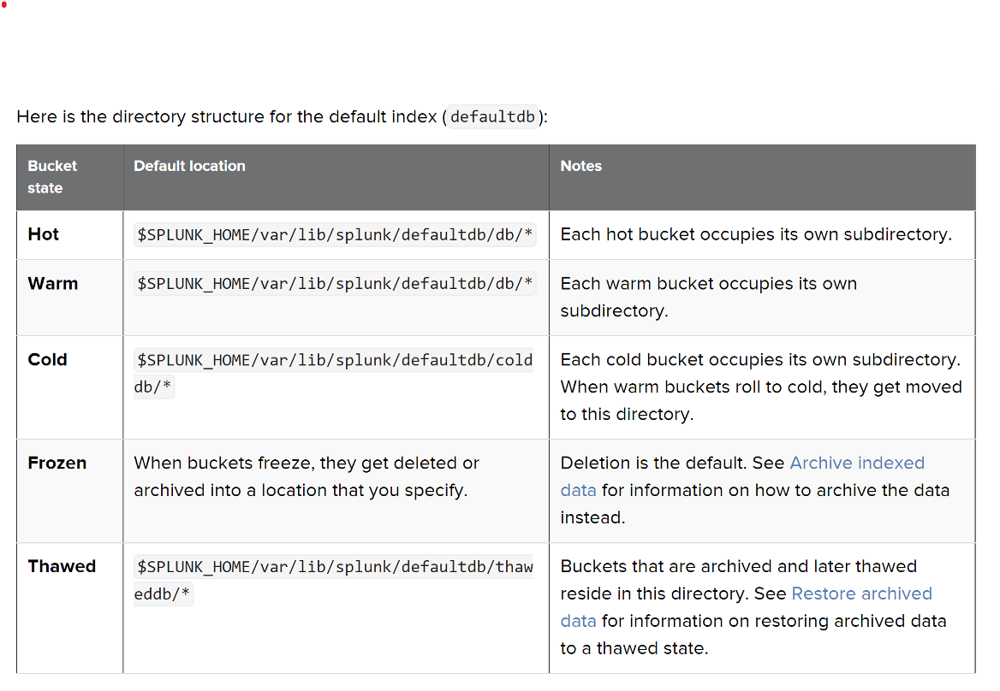

- [Roles in Splunk](#roles-in-splunk)
- [By default, Splunk Enterprise comes with the following roles predefined:](#by-default-splunk-enterprise-comes-with-the-following-roles-predefined)
- [Configuration Files](#configuration-files)
- [Precedence Global Context](#precedence-global-context)
- [Precedence App/User Context](#precedence-appuser-context)
- [Six (6) Core Configuration Files](#six-6-core-configuration-files)
- [Other important Configuration Files:](#other-important-configuration-files)
  - [Run this command to Check for typos:](#run-this-command-to-check-for-typos)
- [All About Indexes](#all-about-indexes)
  - [__What is an Indexer__](#what-is-an-indexer)
- [How Indexing Works](#how-indexing-works)
- [How Indexing Works](#how-indexing-works-1)
- [Demo Time – Show the default index directory](#demo-time--show-the-default-index-directory)
- [How Indexing Works](#how-indexing-works-2)
- [How the indexer stores indexes](#how-the-indexer-stores-indexes)
- [How the indexer stores indexes](#how-the-indexer-stores-indexes-1)
- [How to Configure indexes.conf](#how-to-configure-indexesconf)
- [Demo Time – Demonstrate How to Secure Copy A File (scp command)](#demo-time--demonstrate-how-to-secure-copy-a-file-scp-command)
- [Demo Time – Create an Index](#demo-time--create-an-index)

# Roles in Splunk 
- A role contains a set of capabilities.
Capabilities specify what actions are available to roles.
- Users are assigned to roles. 
- The authorize.conf configuration file provides a list of the user actions that you can use to configure roles.

# By default, Splunk Enterprise comes with the following roles predefined:
- **admin** -- this role has the most capabilities assigned to it.
- **power** -- this role can edit all shared objects (saved searches, etc.) and alerts, tag events, and other similar tasks.
- **user** -- this role can create and edit its own saved searches, run searches, edit its own preferences, create and edit event types, and other similar tasks.
- **can_delete** -- This role allows the user to delete by keyword. This capability is necessary when using the delete search operator.

- [**Click here to Read More on Roles and Capabilities**](https://docs.splunk.com/Documentation/Splunk/latest/Security/Rolesandcapabilities)
- [**Click here to Read More on Add and edit roles with authorize.conf**](https://docs.splunk.com/Documentation/Splunk/latest/Security/Rolesandcapabilities)
- [**Click here to Read More on Configure users with the CLI**](https://docs.splunk.com/Documentation/Splunk/latest/Security/ConfigureuserswiththeCLI)

# Configuration Files
Splunk software uses configuration files to determine nearly every aspect of its behavior.
These file copies are usually layered in directories that affect either the users, an app, or the system as a whole.
The configuration files are stored in the following locations:
1. **Default files:** $SPLUNK_HOME/etc/system/default
2. **Local files:** $SPLUNK_HOME/etc/system/local
3. **App files:** $SPLUNK_HOME/etc/apps/
4. **User files:** $SPLUNK_HOME/etc/users

Configuration files operate in either a global context or in the context of the current app and user:

    1. Global Context: Activities like indexing take place in a global context. For example, configuration files that determine monitoring or indexing behavior occur outside of the app and user context and are global in nature.

    2. App/user Context: Some activities, like searching, take place in an app or user context. The app and user context is vital to search-time processing, where certain knowledge objects or actions might be valid only for specific users in specific apps.

Generally speaking, files that affect data input, indexing, or deployment activities are global; files that affect search activities usually have an app/user context.

- [**Click here to Read More on Where to find the Configuration files**](https://docs.splunk.com/Documentation/Splunk/latest/Admin/Wheretofindtheconfigurationfiles)

# Precedence Global Context
- When the file context is global, directory priority descends in this order;
    1. System local directory -- highest priority
    2. App local directories
    3. App default directories
    4. System default directory -- lowest priority

- For example;
When consuming a global configuration, such as **inputs.conf**, Splunk software first uses the attributes from any copy of the file in **system/local**. 
- Then it looks for any copies of the file located in the app directories, adding any attributes found in them, but ignoring attributes already discovered in **system/local**. 
- As a last resort, for any attributes not explicitly assigned at either the system or app level, it assigns default values from the file in the **system/default** directory.

# Precedence App/User Context
For files with an app/user context, directory priority descends from user to app to system;
1. User directories for current user -- highest priority
2. App directories for currently running app (local, followed by default)
3. App directories for all other apps (local, followed by default) -- for exported settings only
4. System directories (local, followed by default) -- lowest priority

- [**Click here to Read More on Where to find the Configuration files**](https://docs.splunk.com/Documentation/Splunk/latest/Admin/Wheretofindtheconfigurationfiles)

# Six (6) Core Configuration Files
Six important Splunk configuration files that are commonly used and play crucial roles:
1. **inputs.conf:** This file is used to configure the inputs that Splunk monitors. It defines data inputs, such as log files, network ports, and other sources of machine data.
2. **outputs.conf:** This file is used to configure where Splunk sends its data. It specifies settings for forwarding data to other Splunk instances, as well as other output destinations.
3. **props.conf:** This file is used to configure settings that are specific to data parsing and indexing. It defines how Splunk should interpret different types of data, such as log files, and extract fields.
4. **transforms.conf:** This file is used to define field extractions, aliases, and other data transformations. It is often used in conjunction with props.conf to customize how data is processed during indexing.				
5. **indexes.conf:** This file is used to configure settings related to indexing. It defines parameters such as the location of index data on disk, retention policies, and other characteristics of indexed data.
6. **server.conf:** This file contains settings that apply to the entire Splunk instance, such as licensing, authentication, and general server behavior.

# Other important Configuration Files:
1. **authorize.conf**
   
[Read more on Configuration Files](https://docs.splunk.com/Documentation/Splunk/latest/Admin/Listofconfigurationfiles)

## Run this command to Check for typos: 
```js
./splunk btool check
```

# All About Indexes
## __What is an Indexer__ 
>**Splunk indexers** provide data processing and storage for local and remote data and host the primary Splunk data store. The Splunk component that stores Splunk data.

>An **Index** is the repository for data. Thus, it is where data is stored in Splunk

# How Indexing Works
1. As the Splunk indexes your data, it creates a number of files:
The raw data in compressed form (the rawdata journal)
Indexes that point to the raw data (tsidx files)
Some other metadata files

2. Together, these files constitute the Splunk Enterprise index.
3. The files reside in sets of directories, or buckets, organized by age.
4. Each bucket contains a rawdata journal, along with associated tsidx and metadata files.
5. The data in each bucket is bounded by a limited time range
6. An index typically consists of many buckets, and the number of buckets grows as the index grows.
7. As data continues to enter the system, the indexer (Splunk) creates new buckets to accommodate the increase in data.

# How Indexing Works
1. As the Splunk indexes your data, it creates a number of files:
The raw data in compressed form (the rawdata journal)
Indexes that point to the raw data (tsidx files)
Some other metadata files

2. Together, these files constitute the Splunk Enterprise index.
3. The files reside in sets of directories, or buckets, organized by age.
4. Each bucket contains a rawdata journal, along with associated tsidx and metadata files.
5. The data in each bucket is bounded by a limited time range
6. An index typically consists of many buckets, and the number of buckets grows as the index grows.
7. As data continues to enter the system, the indexer (Splunk) creates new buckets to accommodate the increase in data.

[Read More on How Indexing Works]( https://docs.splunk.com/Documentation/Splunk/latest/Indexer/Howindexingworks)

# Demo Time – Show the default index directory

# How Indexing Works


# How the indexer stores indexes
>A bucket moves through several states as it ages
1. **hot**
2. **warm**
3. **cold**
4. **frozen**
5. **Thawed**
# How the indexer stores indexes  


[Read More on Splunk Stores Indexes](https://docs.splunk.com/Documentation/Splunk/9.3.1/Indexer/HowSplunkstoresindexes)

# How to Configure indexes.conf
**The indexes.conf** is used for;
Creating indexes (where Splunk stores data) 
Determine the indexes properties (Size of the index, retention policies and other settings).
[Read More on Indexes Conf](https://docs.splunk.com/Documentation/Splunk/latest/Admin/Indexesconf)

# Demo Time – Demonstrate How to Secure Copy A File (scp command)
```bash
scp -i my_key.pem -r bootcamp_students_details ubuntu@3.140.185.8:/tmp
```

# Demo Time – Create an Index
1. Apply Volume-Based Retention
2. Apply Time-Based Retention

```bash
[windows]
coldPath = $SPLUNK_DB/windows/colddb
homePath = $SPLUNK_DB/windows/db
maxTotalDataSizeMB = 512000
thawedPath = $SPLUNK_DB/windows/thaweddb
disabled = false

Creating Indexes for linux logs
[linux]
coldPath = $SPLUNK_DB/linux/colddb
homePath = $SPLUNK_DB/linux/db
maxTotalDataSizeMB = 512000
thawedPath = $SPLUNK_DB/linux/thaweddb
disabled = false

[my_second_index]

homePath   = $SPLUNK_DB/my_second_indexdb/db
coldPath   = $SPLUNK_DB/my_second_indexdb/colddb
thawedPath = $SPLUNK_DB/my_second_indexdb/thaweddb
maxDataSize = 200
```


