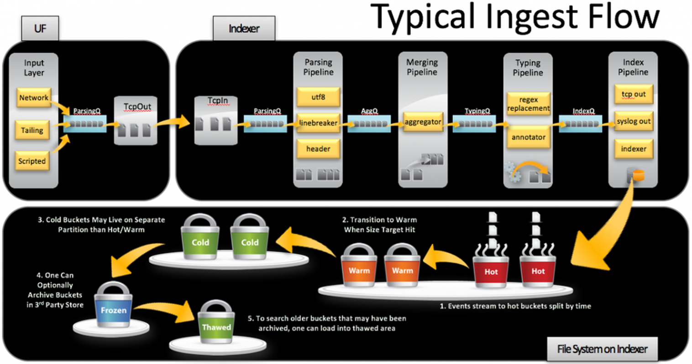

# Interview Questions (Splunk)
### 1. When you want to parse data and you are finding it dificult, where will you go or what website will you website to find app developed by others without starting from scratch
**Answer: Splunk base**

### 2. When you onboard data and everything looks good, the indexing port open, you have configured the inputs.conf. whhat tool is the best for troubleshoot to find the problem
**Answer: Btool**

This might be that, there double inputs.conf, one in apps local and other in the system local. This will be conflicting and splunk will find it difficult which one to use, and it will may not use any of them, which will lead to the data not been ingested to splunk. Deleting one probably the one at systems local and logs will start coming

### 3. What stage of the data ingest flow is when incoming raw data stream is breakdown into individual events based on line breaks (linebreaker).
**Answer: Parsing Pipeline**

### 4. What stage of the data ingest flow is when metadata (e.g., host, source, sourcetype) is extrated from incoming raw data stream
**Answer: Parsing Pipeline**

### 5. What stage of the data ingest flow is when multiple small chunks of data are combined into larger aggregated events to optimize processing (aggregator).
**Answer: Merging Pipeline**

### 6. What stage of the data ingest flow (Indexing Pipeleine) is when regex patterns applies to the data
**Typing Pipeline**

### 7. What stage of the data ingest flow is when data is finalizes, processed and prepares for indexing.
**Answer: Index Pipeline**

### 8. What is the difference between Splunk App and Splunk Add-on

### 9. Which Configuration file is use for accessing user data or managing users and roles
**Answer: authorize.conf**

### 11. What are the two types of indexes and what types data they can stored
- **Metric Index:** A Metric Index is designed to store time-series data such as performance metrics (CPU, memory, latency, etc.)
- **Event Index:** Event Index
An Event Index is the traditional type of Splunk index, used to store unstructured or semi-structured log/event data such as application logs, security logs, or transaction logs.

### 12. Where can you find splunk logs and list some of the internal logs

### 13. What is the name of splunk daemon and what its does

### 14. Where can you find the fishbucket
/opt/splunk/var/lib/splunk/

### 15. What is the purpose of splunk fishbucket
The fishbucket in Splunk is a special directory that keeps track of data inputs. It ensures that Splunk does not re-index the same data and can resume data processing from where it left off in the event of a disruption.

#### Seek Pointers
- **What it is:•• A seek pointer is a marker that tells Splunk where it left off in a file when it last indexed data.
- Purpose: It helps Splunk efficiently resume reading a file by skipping over already-processed data instead of starting from the beginning. Which keeps track of how much of your file has been indexed into Splunk.
- How it works: When Splunk reopens a file, it uses the seek pointer to jump directly to the last read position. The fishbucket is like the memory of Splunk to know whether a log has been ingested already.

#### Cyclic Redundancy Checkers (CRCs)
- What it is: CRC is a hash value or checksum generated for a file's content to uniquely identify it.
- Purpose: It ensures Splunk can distinguish between different files or detect when a file has changed (e.g., truncated or rotated logs). How it works:
- Splunk generates a CRC for the initial few kilobytes of a file to verify its identity.
- If the CRC of a file does not match the recorded value, Splunk treats it as a new file. To prevent re-indexing a previously-read file Splunk runs a cyclic redundancy check against first and last 256 bytes of a file.

### 16. What are the ways splunk ingest data
File Monitoring using Universal Forwarders
API Calls using HTTP Event Collector (HEC) is a feature in splunk that allow you to send data to splunk over HTTP or HTTPS

### 17. What is the management port and when its applicable 
8089, it can be use for distributed search environment,

### 18. What is the default port to communicate with deployment server
8089

### 19. what is the default port for creating search peers
8089

### 20. What is the path splunk store indexes
/opt/splunk/var/lib/splunk

### 21. What is the usage of KV store

### 22. How do you upgrade splunk enterprise on your Linux Server
I will first use the tar command to tar the SPLUNK_HOME/etc or /opt/splunk/etc and copy as a backup. Then i will download the new splunk and install on my linux server

### 23. As a splunk engineer what will do if your splunk server is not running
i will move to the bin directory and use ./splunk status to check the status of my splunk server, if its not running running, i will use ./splunk start to start it. if its already running, i will check my splunk server security groups or firewalls to see if the splunk web default port 8000 is open

### 24. What conf file will use to monitor syslogs
inputs.conf

### 25. If your is writting all the sys logs into a file, how do you separate the logs you dont need from the one you need
NB: if you disable or stop monitoring the file at inputs.conf, it will stop monitoring all the logs, so what you will do is to use the props.conf and transform.conf to separate what you need from what you dont need 

### 26. In what instance will you choose a universal forwarder over a heavy forworder.
When i want to only forward data from my sever generating the logs to my splunk instance or my indexer withour parsing the data, its more preferable to use the light weight version instead of the heavy forworder

### 27. As Splunk Engineer, if your splunk server slow, how do you troubleshoot it
Check System Resources: Verify that the server has sufficient CPU, memory and disk space 

Monitor Splunk Logs: Check the splunk logs for errors or warnings that might indicate the cause of the slowdown

### 28. What linux command will use to verify CPU, memory and disk space 

### 29. Which Splunk components typically reside on the machines where data originates? Ans. Forwarder
### 30. Name an important dependency to initiate DB Connecttaskserver. 
Ans. Java Runtime Environment (JRE)

### 31. What is the default RDP TCP port. 
Ans. 3389
### What are the types of search modes in Splunk? 
Ans. Fast, Smart, and Verbose
### 32. Name some configurationfiles relating to Splunk platform and their Functions. 
Ans. **inputs.conf** – monitoring/ingesting data into splunk and enable listening

**outputs.conf** – instruction for the location where data is sent Props.conf – data parsing

**server.conf** – details/information about the server
**indexes.conf** – for indexing data and data retention

### 33. How many types of Splunk forwarders are there? Ans. 2 (UF and HF)

### 34. List Splunk components.
Ans. Forwarder, indexer, Seach Head
1. NamesomedifferencesbetweentheUFandHF. Ans. UF without GUI while HF with GUI
UF without parsing/indexing capabilities while HF parsing and indexing capabilities
1. What is the use of a deployment server in Splunk administration?
Ans. The deployment server is the tool for distributing configurations, apps, and content updates to groups of Splunk Enterprise instances.
1.  Name 3 Splunk management components.
Ans. License manager, Deployment Server, Cluster manager, Deployer, and Monitoring Console
1.  Name some Splunk default ports Ans.
8000 – Web port
8089 – Management port 9997 – Receiving port 8088 – HEC port
8091 – KV Store port
1.  What is the command to check disk space in Linux Ans. df -h
2.  The location/path of Splunk internal logs from the CLI/backend Ans. SPLUNK_HOME$/splunk/var/log/splunk
3.  What is the btool command used for
Ans. btool command is used to troubleshoot configuration files.
1.  Name 3 types of Splunk License Ans. Enterprise, Trial, Free
2.  What is the fish bucket
Ans. A subdirectory where Splunk software tracks how far into a file indexing has progressed, to enable the software to detect when data has been added to the file and resume indexing. The fishbucket subdirectory contains seek pointers and CRCs for indexed files.

### Splunk Ports
| **Port**             | **Component**                     | **Default/Convention**       | **Description**                                                                                                         |
| -------------------- | --------------------------------- | ---------------------------- | ----------------------------------------------------------------------------------------------------------------------- |
| **514**              | Syslog                            | Convention - Not Recommended | Syslog (TCP or UDP). Recommended to send Syslog to a Syslog Collector tool like Syslog-NG or rsyslog instead of Splunk. |
| **8000**             | Web Interface                     | Default                      | Splunk Web (HTTP by default).                                                                                           |
| **8080, 9887**       | Indexers                          | Default                      | Port used for Indexer replication.                                                                                      |
| **8081, 8181, 9887** | Search Heads                      | Default                      | Search Head Cluster (SHC) replication.                                                                                  |
| **8088**             | HTTP Event Collector (HEC)        | Default                      | Collects data sent to Splunk over HTTP.                                                                                 |
| **8089**             | Splunk                            | Default                      | Management port.                                                                                                        |
| **8089**             | Indexers                          | Default                      | REST API access for indexers.                                                                                           |
| **8089**             | Deployment Server                 | Default                      | Management port for Splunk deployment server.                                                                           |
| **8089**             | Search Heads                      | Default                      | Management port for Splunk search heads.                                                                                |
| **8191**             | KVStore                           | Default                      | Internal KVStore communication and replication.                                                                         |
| **9997**             | Forwarders                        | Convention                   | Default forwarding port for sending data to indexers.                                                                   |
| **9998**             | Universal Forwarders and Indexers | Default                      | SSL communication between forwarders and indexers.                                                                      |

### 1. What is the difference between server.conf and web.conf
**web.conf** controls splunk web interface, configure settings such as web server ports, SSl, and user themes whiles **sever.conf** controls overall splunk server configuration and operations. Configures settings such as server name, host name and indexing settings

### Explain the Data Ingest Flow Pipeline in splunk
# Splunk Data Ingestion Pipeline 

The top section of the image represents the Typical Ingest Flow in Splunk. It shows how data is processed from ingestion to indexing. Let me break it down into its major stages:

## Input Layer (UF - Universal Forwarder)
This is where data enters the Splunk ecosystem. The Universal Forwarder collects data from various sources:
- **Network:** Data sent over TCP or UDP.
- **Tailing:** Reads logs from files (e.g., /var/log or application logs).
- **Scripted:** Data collected by running custom scripts.

#### The data passes through the **Parsing Queue (ParsingQ)** and is sent to the TcpOut component to forward it to the indexer.

### Indexer (Data Processing Pipelines)
The indexer handles the data's ingestion, processing, and storage. The pipelines shown in the image describe the sequential steps Splunk follows:

### Parsing Pipeline
- Splits the incoming raw data stream into individual events based on line breaks (linebreaker).
- Extracts metadata (e.g., host, source, sourcetype) using headers.

### Merging Pipeline
- Combines multiple small chunks of data into larger aggregated events to optimize processing (aggregator).

### Typing Pipeline
- Applies regex patterns to identify and modify data.
- Annotates events with additional information, such as timestamps, fields, and key-value pairs.

### Index Pipeline
- Finalizes the processed data and prepares it for indexing.
- Sends events to: The indexer, where data is stored.
- Outputs like tcp_out (forwarding) or syslog_out (logging).

### File System Buckets Explanation of Data Ingest Flow
This section transitions into the data storage model of Splunk on the indexer. It shows how processed data is stored in "buckets" with different life cycle stages:
- **Hot:** Actively written-to buckets for real-time data ingestion. ($SPLUNK_HOME/var/lib/splunk/defaultdb/db/*)
- **Warm:** Data moved from "hot" buckets after they are full. ($SPLUNK_HOME/var/lib/splunk/defaultdb/db/*)
- **Cold:** Older data that is no longer frequently accessed. ($SPLUNK_HOME/var/lib/splunk/defaultdb/colddb/*)
- **Frozen:** Data archived to third-party storage systems. its custom specify by the user
- **Thawed:** Archived data brought back for searching. ($SPLUNK_HOME/var/lib/splunk/defaultdb/thaweddb/*)

This process ensures that Splunk efficiently handles large-scale data ingestion while maintaining search and retrieval performance. Each stage optimizes the flow from raw data collection to searchable storage.

