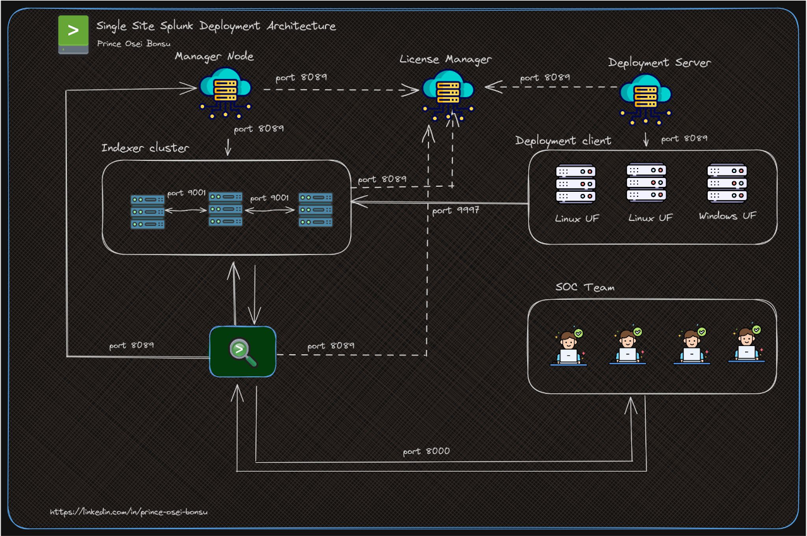
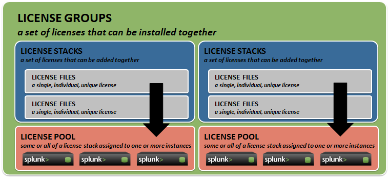

<!--

 
 <h2 align="center">GitHub Readme Stats</h2>
 
Get dynamically generated GitHub stats on your READMEs!

 -->

#  Security Event and Information Management (SIEM)

- [Security Event and Information Management (SIEM)](#security-event-and-information-management-siem)
- [Introduction to Splunk – Lecture 1 (Admin Class)](#introduction-to-splunk--lecture-1-admin-class)
- [Why Splunk?](#why-splunk)
  - [Splunk Bridged the following gaps:](#splunk-bridged-the-following-gaps)
- [How does Splunk Work Using Graphical/Pictorial Representation?](#how-does-splunk-work-using-graphicalpictorial-representation)
  - [Click here splunk documentation to read more on the splunk website](#click-here-splunk-documentation-to-read-more-on-the-splunk-website)
- [What is Splunk Licensing](#what-is-splunk-licensing)
- [Splunk Licensing Using Graphical/Pictorial Representation.](#splunk-licensing-using-graphicalpictorial-representation)
- [How to add Splunk License on the Splunk Web/GUI](#how-to-add-splunk-license-on-the-splunk-webgui)
  - [Click here splunk documentation to read more on the splunk website](#click-here-splunk-documentation-to-read-more-on-the-splunk-website-1)
- [:sparkling\_heart: Support the project](#sparkling_heart-support-the-project)

# Introduction to Splunk – Lecture 1 (Admin Class)

>## What is Splunk?
>Splunk is a big data platform that simplifies the task of collecting and managing massive volumes of machine-generated data and searching for information within it. The Google for machine data.

# Why Splunk?
> - Before Splunk, it was extremely cumbersome to troubleshoot IT systems and detect patterns when something went wrong.
> - Most IT professionals barely had access to tools to search through logs.

## Splunk Bridged the following gaps:
> - Monitor, search through, index and correlate data from a variety of sources.
> - Easily search and analyze big data and set up relevant alerts, reports and visualizations.
> - Power your cybersecurity operations, from incident response and management to threat detection and threat hunting.
> - Make compliance and reporting a breeze.
> - Get full visibility into your IT and business operations.

# How does Splunk Work Using Graphical/Pictorial Representation?

>## __What is an Indexer__ 
>Splunk indexers provide data processing and storage for local and remote data and host the primary Splunk data store. The Splunk component that stores Splunk data.

>## __What is a Search Head__
> Splunk component that distributes searches to the indexers. Users perform queries, analysis, create alerts and visualization using the Search Head.
> 

>## What are Forwarders 
>Forwarders are Splunk instances that forward data to remote indexers for data processing and storage. In most cases, they do not index data themselves.

## Click here [splunk documentation](https://docs.splunk.com/Documentation/Splunk/latest/Capacity/ComponentsofaSplunkEnterprisedeployment "Read More on Introduction to Splunk") to read more on the splunk website

# What is Splunk Licensing
>Splunk is a proprietary software – Therefore permission or licensing is required.
The amount of data is indexed and stored on disk is reported to the license manager for license volume tracking.

># Splunk License Groups
> 1. Enterprise/Sales Trial Group
> 2. Enterprise Trial Group
> 3. Free Group
> 4. Forwarder Group

# Splunk Licensing Using Graphical/Pictorial Representation.

># What are License Stacks
> - A stack is one or more licenses that allow their assigned license volume to be added together.
> - This allows you to increase indexing volume capacity without the need to swap out licenses.
> - If your daily data ingest exceeds the assigned license volume, you will receive warnings at the stack or pool level depending upon how the license volume was allocated

# How to add Splunk License on the Splunk Web/GUI

## Click here [splunk documentation](https://docs.splunk.com/Documentation/Splunk/latest/Admin/Groups,stacks,pools,andotherterminology "Read More on Splunk Licensing") to read more on the splunk website

# :sparkling\_heart: Support the project

I open-source almost everything I can and try to reply to everyone needing help using these projects. Obviously,
this takes time. You can use this service for free.

However, if you are using this project and are happy with it or just want to encourage me to continue creating stuff, there are a few ways you can do it:

*   Giving proper credit when you use github-readme-stats on your readme, linking back to it. :D
*   Starring and sharing the project. :rocket:

Thanks! :heart:

***

Credits:
- Sir Prince
- Sir Willy
- AGSDAC - Splunk Training
- [Splunk Docs](https://docs.splunk.com/Documentation)

Contributions are welcome! <3

Made with :heart: and Markdown.

**Powered By Nana Kwasi Ofosu-Duodu** :sparkling\_heart: