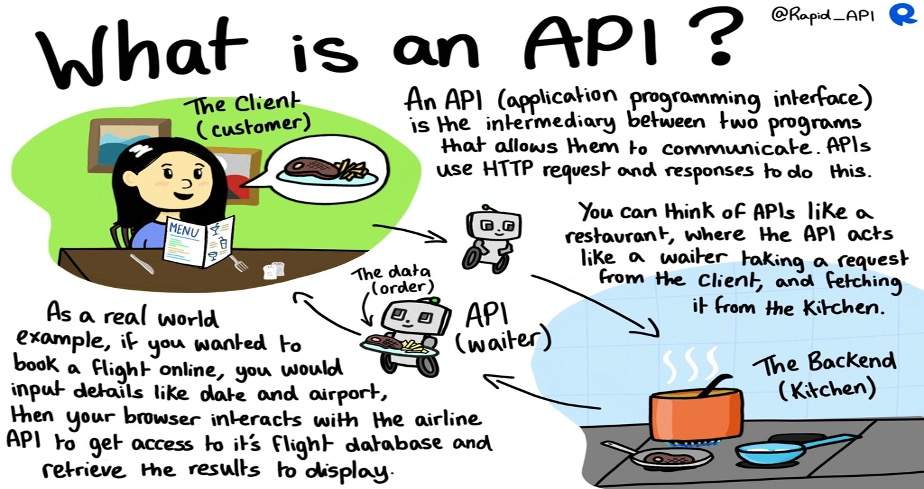
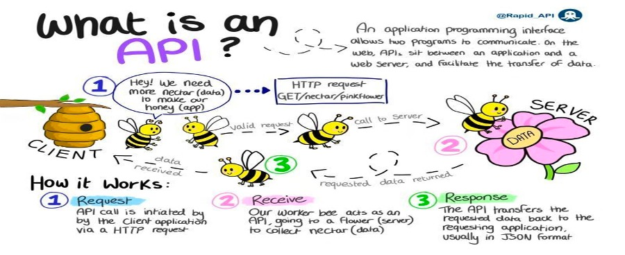

# APPLICATION PROGRAMMING INTERFACE (API)
- An API is a programmatic way of services communicate with one another.
- API tells you a specific way you can interact with something.
- Data can be ingested into Splunk via API.
- Usually, data is ingested from Cloud services using APIs through either Scripted Inputs or Modular Inputs.




[Read More API from Splunk Docs](https://docs.splunk.com/Documentation/Splunk/9.3.1/Data/Getdatafromscriptedinputs#Get_data_from_APIs_and_other_remote_data_interfaces_through_scripted_inputs)

# Demo Time – Using API
## Ingest Data into Splunk via API using Scripted Inputs

# Create an app (directory) in the apps directory
Path:
```bash
cd /opt/splunk/etc/apps
```
Steps:
```bash
mkdir -p api_app/local
```
### You create an inputs.conf file at the local directory to monitor the data to splunk
```bash
[script:///opt/splunk/etc/apps/api_app/local]
index = my_index
```
## Creating the Bin Directory
```bash
mkdir bin
```
The python script will be put in the bin directory
```bash
cd /opt/splunk/etc/apps/api_app/bin
```

```bash
# Import the necessary libaries
import requests
import re
from random import randint
import json


# My API KEY
apiKEY="c738b75f4bbf560194d81d4e88f462ab"

# Send a GET request to an API
def send_request(apiURL, apiKEY=apiKEY):
    """Submit GET request to api server."""
    # Set params
    params = {
        "api_key": apiKEY
    }

    # Handle client side errors
    try:
        # If the base URL is themoviedb
        num = str(randint(1,1000))
        # Send API request
        req = requests.get(url=f"{apiURL}/{num}", params=params, verify=True)
        # Handle JSONDecodeError
        res = json.dumps(json.loads(req.text))

    # Catch client side error
    except requests.exceptions.HTTPError as e:
        # Assign to a variable
        print(f"Error occured 🥵 \n{e}")

    # Return the json response
    return res


# Submit a GET request
print(send_request(apiURL="https://api.themoviedb.org/3/movie"))

```

